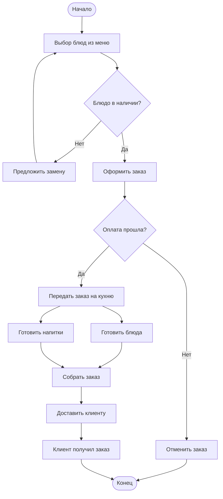

# Flowchart: Обработка заказа еды

```mermaid
flowchart TD
    A([Начало]) --> B[Выбор блюд из меню]
    B --> C{Блюдо в наличии?}
    C -- Нет --> D[Предложить замену]
    D --> B
    C -- Да --> E[Оформить заказ]
    E --> F{Оплата прошла?}
    F -- Нет --> G[Отменить заказ]
    G --> Z([Конец])
    F -- Да --> H[Передать заказ на кухню]
    H --> I[Готовить блюда]
    H --> J[Готовить напитки]
    I --> K[Собрать заказ]
    J --> K
    K --> L[Доставить клиенту]
    L --> M[Клиент получил заказ]
    M --> Z
```