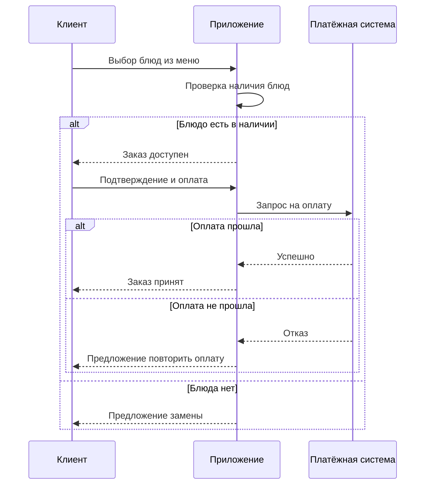

# Sequence Diagram: Оформление и оплата заказа

```mermaid
sequenceDiagram
    participant К as Клиент
    participant П as Приложение
    participant ПС as Платёжная система

    К->>П: Выбор блюд из меню
    П->>П: Проверка наличия блюд
    alt Блюдо есть в наличии
        П-->>К: Заказ доступен
        К->>П: Подтверждение и оплата
        П->>ПС: Запрос на оплату
        alt Оплата прошла
            ПС-->>П: Успешно
            П-->>К: Заказ принят
        else Оплата не прошла
            ПС-->>П: Отказ
            П-->>К: Предложение повторить оплату
        end
    else Блюда нет
        П-->>К: Предложение замены
    end
```

