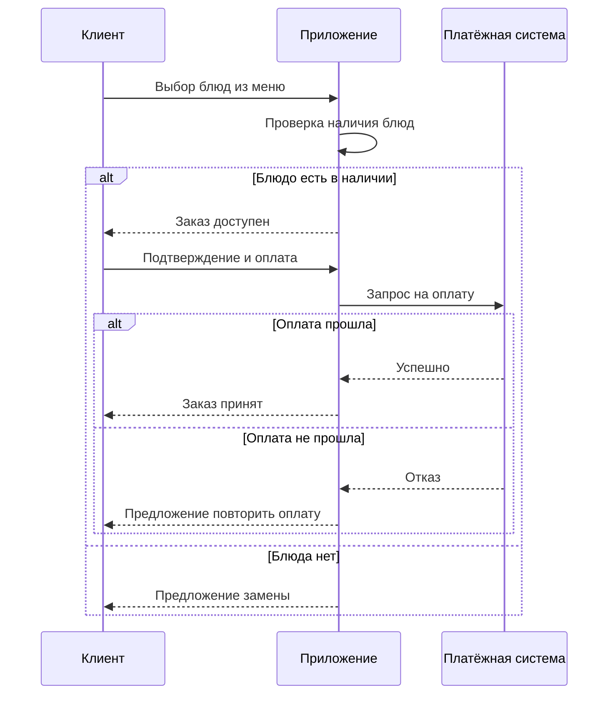
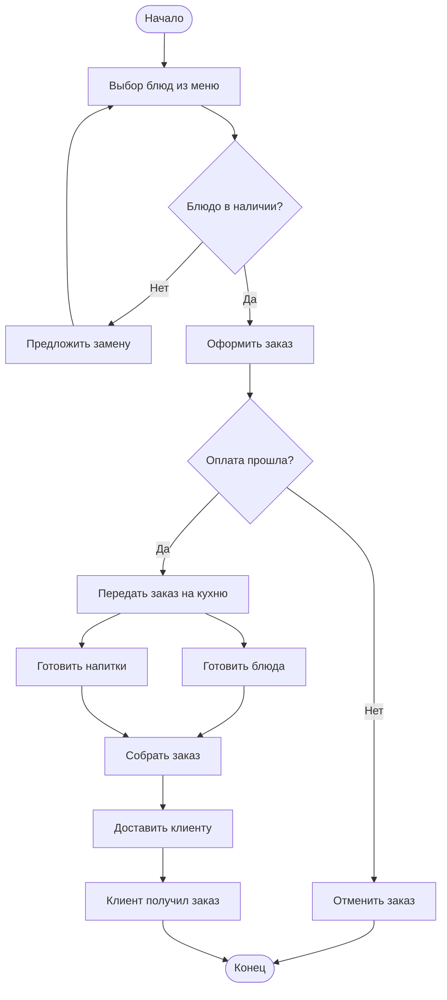

# Отчёт по лабораторной работе №1

## Тема
Моделирование процессов с использованием Git и визуальных нотаций.

## Описание процесса
Описывала процесс заказа еды в ресторане с доставкой.Клиент выбирает блюда в приложении, система проверяет их наличие и обрабатывает оплату. Если оплата прошла — заказ готовится и доставляется курьером; если нет — отменяется или предлагается повторить.

## Диаграммы

### BPMN-диаграмма

### UML Activity Diagram

### Sequence Diagram

### Flowchart

## Diff: текстовый vs бинарный формат

### BPMN (.bpmn) — текстовый XML

### PNG (.png) — бинарный

### UML Activity (.drawio) — текстовый XML

### UML Activity PNG (.png) — бинарный

### Sequence (.md) — текстовый Mermaid

### Flowchart (.md) — текстовый Mermaid

## Выводы
В ходе работы вспомнила базовые команды Git, вспомнила как с ним работать. Узнала о разнообразии диаграмм: какие они бывают, как их строить, попробовала новые для себя инструменты. На практике увидела как работает команда diff для разных типов файлов.